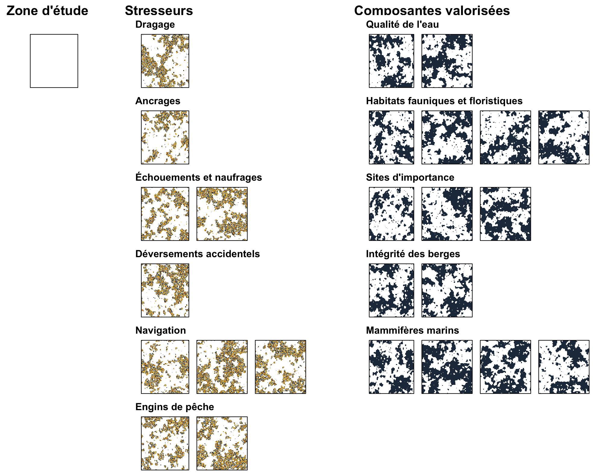
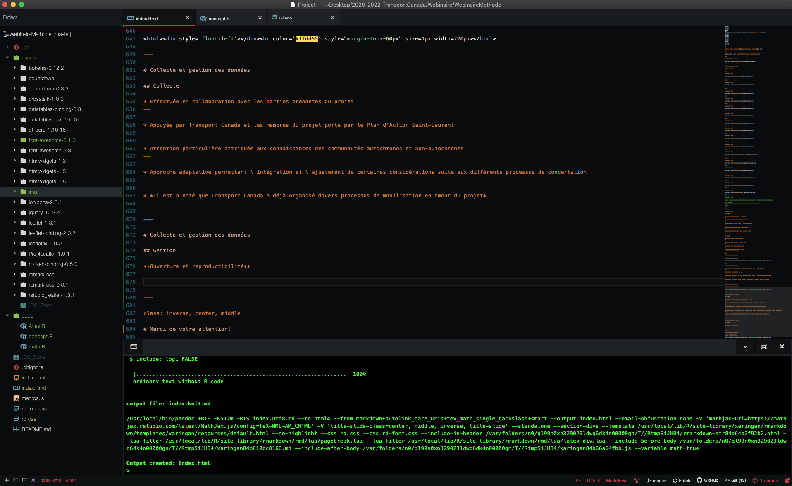

```{r setup, include=FALSE}
htmltools::tagList(rmarkdown::html_dependency_font_awesome())
```
<!--
rmarkdown::render('./index.Rmd')
-->

class: title-slide, middle


# Effets cumulatifs des activités maritimes sur le Saint-Laurent et la rivière Saguenay - Projet pilote


.instructors[
  David Beauchesne, Cindy Grant & Philippe Archambault
]

<a href="https://www.ulaval.ca/"></img></a>

---


class: inverse, center, middle

# Équipe de travail

<html><div style='float:left'></div><hr color='#ffdd55' style="margin-top:-60px" size=1px width=720px></html>

---

# Équipe de travail

<br/>

<center>
<div class="divTable team">
<div class="divTableBody">
<div class="divTableRow">
<div class="divTableCell">

</div><div class="divTableCell">

</div><div class="divTableCell">

</div></div>
<div class="divTableRow">
<div class="divTableCell"><b>David Beauchesne</b></div><div class="divTableCell"><b>Cindy Grant</b></div><div class="divTableCell"><b>Philippe Archambault</b></div></div>
</div>
</center>


---

class: inverse, center, middle

# Évaluations d'effets environnementaux

<html><div style='float:left'></div><hr color='#ffdd55' style="margin-top:-60px" size=1px width=720px></html>

---

# Évaluations d'effets environnementaux

<p style="line-height:1.4">
<b>Évaluation d'impact</b>:
<br/>
<i>Évaluation des effets d’un projet désigné effectuée conformément à la présente loi.‍</i>
</p>

--

<p style="line-height:1.4">
<b>Effets cumulatifs</b>:
<br/>
<i>Effets environnementaux cumulatifs susceptibles de résulter d’un projet, combinés aux effets environnementaux d’autres activités concrètes, passées ou futures.‍</i>
</p>

--

<p style="line-height:1.4">
<b>Évaluation régionale</b>:
<br/>
<i>Les évaluations régionales permettent au gouvernement du Canada d’aller au-delà des évaluations d’impact limitées à un projet afin de comprendre le contexte régional, en fournissant une analyse plus complète de façon à éclairer les décisions de futures évaluations d’impact.‍</i>
</p>


<!--
https://www.parl.ca/DocumentViewer/fr/42-1/projet-loi/C-69/sanction-royal
https://www.canada.ca/fr/agence-evaluation-impact/services/politiques-et-orientation/evaluation-regionale-la-loi-evaluation-impact.html
-->

---

class: inverse, center, middle

# Étapes

<html><div style='float:left'></div><hr color='#ffdd55' style="margin-top:-60px" size=1px width=720px></html>

---

# Étapes

1. Identifier, impliquer et communiquer avec les parties prenantes de l’évaluation

---

# Étapes

1. Identifier, impliquer et communiquer avec les parties prenantes de l’évaluation
2. Portée de l’évaluation <!-- (objectifs, limites, activités, facteurs de stress, composantes valorisées) -->


---

# Étapes

1. Identifier, impliquer et communiquer avec les parties prenantes de l’évaluation
2. Portée de l’évaluation
3. Portrait de la zone à l'étude
    * Activités et facteurs de stress
    * Composantes valorisées
    * Vulnérabilité

---

# Étapes

1. Identifier, impliquer et communiquer avec les parties prenantes de l’évaluation
2. Portée de l’évaluation
3. Portrait de la zone à l'étude
    * Activités et facteurs de stress
    * Composantes valorisées
    * Vulnérabilité
4. Analyse des effets cumulatifs

---

# Étapes

1. Identifier, impliquer et communiquer avec les parties prenantes de l’évaluation
2. Portée de l’évaluation
3. Portrait de la zone à l'étude
    * Activités et facteurs de stress
    * Composantes valorisées
    * Vulnérabilité
4. Analyse des effets cumulatifs
5. Diagnostic de l'analyse

---

# Étapes

1. Identifier, impliquer et communiquer avec les parties prenantes de l’évaluation
2. Portée de l’évaluation
3. Portrait de la zone à l'étude
    * Activités et facteurs de stress
    * Composantes valorisées
    * Vulnérabilité
4. Analyse des effets cumulatifs
5. Diagnostic de l'analyse
6. Processus décisionnels et de gestion

---

# Étapes

1. Identifier, impliquer et communiquer avec les parties prenantes de l’évaluation
2. Portée de l’évaluation
3. Portrait de la zone à l'étude
    * Activités et facteurs de stress
    * Composantes valorisées
    * Vulnérabilité
4. Analyse des effets cumulatifs
5. Diagnostic de l'analyse
6. Processus décisionnels et de gestion
7. Suivi et gestion adaptative

---

# Étapes

1. **<span style="color:#c13319;">Identifier, impliquer et communiquer avec les parties prenantes de l’évaluation</span>**
2. Portée de l’évaluation
3. Portrait de la zone à l'étude
    * Activités et facteurs de stress
    * Composantes valorisées
    * Vulnérabilité
4. Analyse des effets cumulatifs
5. Diagnostic de l'analyse
6. Processus décisionnels et de gestion
7. Suivi et gestion adaptative

<p style="font-size:17px; line-height:1.4">
<i class="fas fa-arrow-circle-right" style="color:#c13319;"></i> Tout au long du processus
</p>


---

# Étapes

1. <span style="color:#c13319;">Identifier, impliquer et communiquer avec les parties prenantes de l’évaluation</span>
2. **<span style="color:#1989c1;">Portée de l’évaluation</span>**
3. Portrait de la zone à l'étude
    * Activités et facteurs de stress
    * Composantes valorisées
    * Vulnérabilité
4. Analyse des effets cumulatifs
5. Diagnostic de l'analyse
6. Processus décisionnels et de gestion
7. Suivi et gestion adaptative

<p style="font-size:17px; line-height:1.4">
<i class="fas fa-arrow-circle-right" style="color:#c13319;"></i> Tout au long du processus <br/>
<i class="fas fa-arrow-circle-right" style="color:#1989c1;"></i> Préalablement identifié
</p>

---

# Étapes

1. <span style="color:#c13319;">Identifier, impliquer et communiquer avec les parties prenantes de l’évaluation</span>
2. <span style="color:#1989c1;">Portée de l’évaluation</span>
3. **<span style="color:#FECA2C;">Portrait de la zone à l'étude</span>**
    * **<span style="color:#FECA2C;">Activités et facteurs de stress</span>**
    * **<span style="color:#FECA2C;">Composantes valorisées</span>**
    * **<span style="color:#FECA2C;">Vulnérabilité</span>**
4. **<span style="color:#FECA2C;">Analyse des effets cumulatifs</span>**
5. **<span style="color:#FECA2C;">Diagnostic de l'analyse</span>**
6. Processus décisionnels et de gestion
7. Suivi et gestion adaptative

<p style="font-size:17px; line-height:1.4">
<i class="fas fa-arrow-circle-right" style="color:#c13319;"></i> Tout au long du processus<br/>
<i class="fas fa-arrow-circle-right" style="color:#1989c1;"></i> Préalablement identifié<br/>
<i class="fas fa-arrow-circle-right" style="color:#FECA2C;"></i> Travail effectué par notre équipe
</p>


---

# Étapes

1. <span style="color:#c13319;">Identifier, impliquer et communiquer avec les parties prenantes de l’évaluation</span>
2. <span style="color:#1989c1;">Portée de l’évaluation</span>
3. <span style="color:#FECA2C;">Portrait de la zone à l'étude</span>
    * <span style="color:#FECA2C;">Activités et facteurs de stress</span>
    * <span style="color:#FECA2C;">Composantes valorisées</span>
    * <span style="color:#FECA2C;">Vulnérabilité</span>
4. <span style="color:#FECA2C;">Analyse des effets cumulatifs</span>
5. <span style="color:#FECA2C;">Diagnostic de l'analyse</span>
6. **<span style="color:#999999;">Processus décisionnels et de gestion</span>**
7. **<span style="color:#999999;">Suivi et gestion adaptative</span>**

<p style="font-size:17px; line-height:1.4">
<i class="fas fa-arrow-circle-right" style="color:#c13319;"></i> Tout au long du processus<br/>
<i class="fas fa-arrow-circle-right" style="color:#1989c1;"></i> Préalablement identifié<br/>
<i class="fas fa-arrow-circle-right" style="color:#FECA2C;"></i> Travail effectué par notre équipe<br/>
<i class="fas fa-arrow-circle-right" style="color:#999999;"></i> Étapes non-incluses au contrat
</p>

---

class: inverse, center, middle

# Portée

<html><div style='float:left'></div><hr color='#ffdd55' style="margin-top:-60px" size=1px width=720px></html>


---

# Portée

À définir avec Catherine pour éviter l'overlap avec leur présentation

---

class: inverse, center, middle

# Portrait de la zone d'étude

<html><div style='float:left'></div><hr color='#ffdd55' style="margin-top:-60px" size=1px width=720px></html>


---

# Portrait de la zone d'étude

## Activités et facteurs de stress

<table class="TC">
<thead>
<tr>
<th>Activités maritimes</th>
</tr>
</thead>
<tbody>
<tr>
<td>Dragage</td>
</tr>
<tr>
<td>Ancrages</td>
</tr>
<tr>
<td>Échouements et naufrages</td>
</tr>
<tr>
<td>Rejets opérationels</td>
</tr>
<tr>
<td>Déversements accidentels</td>
</tr>
<tr>
<td>Navigation</td>
</tr>
<tr>
<td>Engins de pêche</td>
</tr>
</tbody>
</table>

---

# Portrait de la zone d'étude

## Composantes valorisées

<table class="TC">
<thead>
<tr>
<th>Composantes valorirées</th>
<th>Exemples de sous-catégories</th>
<th>Milieu d'eau douce</th>
<th>Milieu marin</th>
</tr>
</thead>
<tbody>
<tr>
<td>Qualité de l'eau</td>
<td>Turbidité de l'eau</td>
<td style="text-align:center">X</td>
<td style="text-align:center">X</td>
</tr>
<tr>
<td rowspan="3">Habitats fauniques et floristiques</td>
<td>Habitats côtiers</td>
<td style="text-align:center">X</td>
<td style="text-align:center">X</td>
</tr>
<tr>
<td>Habitats benthiques</td>
<td style="text-align:center"></td>
<td style="text-align:center"></td>
</tr>
<tr>
<td>Habitats pélagiques</td>
<td style="text-align:center"></td>
<td style="text-align:center"></td>
</tr>
<tr>
<td rowspan="5">Sites d'importance</td>
<td>Sites culturels et patrimoniaux autochtones</td>
<td style="text-align:center">X</td>
<td style="text-align:center">X</td>
</tr>
<tr>
<td>Sites archéologiques</td>
<td style="text-align:center"></td>
<td style="text-align:center"></td>
</tr>
<tr>
<td>Sites touristiques</td>
<td style="text-align:center"></td>
<td style="text-align:center"></td>
</tr>
<tr>
<td>Aires protégées</td>
<td style="text-align:center"></td>
<td style="text-align:center"></td>
</tr>
<tr>
<td>Hotspots de diversité</td>
<td style="text-align:center"></td>
<td style="text-align:center"></td>
</tr>
<tr>
<td rowspan="2">Intégrité des berges</td>
<td>Artificialisation des berges</td>
<td style="text-align:center">X</td>
<td style="text-align:center"></td>
</tr>
<tr>
<td>Taux d'érosion</td>
<td style="text-align:center"></td>
<td style="text-align:center"></td>
</tr>
<tr>
<td>Mammifères marins</td>
<td>Espèces fréquemment observées</td>
<td style="text-align:center"></td>
<td style="text-align:center">X</td>
</tr>
</tbody>
</table>


---

# Portrait de la zone d'étude

## Vulnérabilité

<table class="TC">
<thead>
<tr>
<th></th>
<th>Dragage</th>
<th>Ancrages</th>
<th>Écouements et naufrages</th>
<th>Déversements accidentels</th>
<th>Navigation</th>
<th>Engins de pêche</th>
</tr>
</thead>
<tbody>
<tr>
<td bgcolor="#0D2C45"><span style="color:#FFFFFF; font-weight:bold;">Qualité de l'eau</span></td>
<td></td>
<td></td>
<td></td>
<td></td>
<td></td>
<td></td>
</tr>
<tr>
<td bgcolor="#0D2C45"><span style="color:#FFFFFF; font-weight:bold;">Habitats</span></td>
<td></td>
<td></td>
<td></td>
<td></td>
<td></td>
<td></td>
</tr>
<tr>
<td bgcolor="#0D2C45"><span style="color:#FFFFFF; font-weight:bold;">Sites d'importance</span></td>
<td></td>
<td></td>
<td></td>
<td></td>
<td></td>
<td></td>
</tr>
<tr>
<td bgcolor="#0D2C45"><span style="color:#FFFFFF; font-weight:bold;">Intégrité des berges</span></td>
<td></td>
<td></td>
<td></td>
<td></td>
<td></td>
<td></td>
</tr>
<tr>
<td bgcolor="#0D2C45"><span style="color:#FFFFFF; font-weight:bold;">Mammifères marins</span></td>
<td></td>
<td></td>
<td></td>
<td></td>
<td></td>
<td></td>
</tr>
</tbody>
</table>

--

Important nombre de combinaisons <i><b>stresseurs - composantes valorisées</b></i> <br/>

--

<b>Stratégie</b>: opinions d'experts, savoirs autochtones, recherche bibliographique

---

# Portrait de la zone d'étude

<center></img></center>

---

class: inverse, center, middle

# Méthode d'analyse

<html><div style='float:left'></div><hr color='#ffdd55' style="margin-top:-60px" size=1px width=720px></html>


---

class: full, middle

<center></img></center>


---

class: full, middle

<center></img></center>


---

class: full, middle

<center></img></center>

---

class: full, middle

<center></img></center>

---

class: full, middle

<center></img></center>

---

class: full, middle

<center></img></center>

---

class: full, middle

<center></img></center>

---

class: full, middle

<center></img></center>

---

class: full, middle

<center></img></center>


---

class: full, middle

<center></img></center>

---

class: full, middle

<center></img></center>


---

class: full, middle

<center></img></center>

---

class: full, middle

<center></img></center>

---

class: full, middle

<center></img></center>

<p style="font-size:15px; line-height:1.4; text-align: right; margin-right: 15%">
<i>Beauchesne et al. 2020</i>
</p>


---

class: full, middle

<center></img></center>

---

class: full, middle

<center></img></center>

<!-- ---

class: full, middle

<iframe id="frame" src="https://david-beauchesne.shinyapps.io/edriversapp/" width="100%" height = "100%"></iframe>

<div id="wrap">
<iframe id="frame" src="https://david-beauchesne.shinyapps.io/edriversapp/"></iframe>
</div>
-->

---

# Méthode d'analyse

## Avantages

* Intégration de différents types de connaissances
--

* Exploration efficace de multiples questions d'intérêt
--

* Identification de séquences d'effets et de chemins d'exposition
--

* Portrait géographique contemporain de la zone d'étude
--

* Positionnement stratégique pour étendre et enrichir l'étude


--
## Limites

* Évaluation relative des effets cumulatifs
--

* Ignore les interactions entre facteurs de stress
--

* Assume des effets additifs entre stresseurs
--

* Contraint par la disponibilité des données
  * *Applicable à toute méthode*

---

class: inverse, center, middle

# Considérations particulières

<html><div style='float:left'></div><hr color='#ffdd55' style="margin-top:-60px" size=1px width=720px></html>

---

# Considérations particulières

* **Évaluation spatiale régionale**: difficulté de considérer des études et projets ponctuels
--

* **Évaluation contemporaine**: 5-10 ans
--

* **Évaluation contrainte par les données disponibles**: aucune collecte de données nouvelles par notre équipe
--

* **Évaluation sectorielle**: d'autres facteurs de stress affectent assurément les composantes valorisées

---

class: inverse, center, middle

# Collecte et gestion des données

<html><div style='float:left'></div><hr color='#ffdd55' style="margin-top:-60px" size=1px width=720px></html>

---

# Collecte et gestion des données

## Collecte

* Effectuée en collaboration avec les parties prenantes du projet
--

* Appuyée par Transport Canada et les membres du projet porté par le Plan d'Action Saint-Laurent
--

* Attention particulière attribuée aux connaissances des communautés autochtones et non-autochtones
--

* Approche adaptative permettant l'intégration et l'ajustement de certaines considérations suite aux différents processus de concertation
--

* *Il est à noté que Transport Canada a déjà organisé divers processus de mobilisation en amont du projet*


---

# Collecte et gestion des données

## Gestion

**Ouverture et reproductibilité**

.pull-left[
<a href="https://www.r-project.org/"></img></a>

<a href="https://www.r-project.org/"></img></a>

]
.pull-right[
<a href="https://github.com/EffetsCumulatifsNavigation"></img></a>

<a href="https://github.com/EffetsCumulatifsNavigation"></img></a>
]


---

class: inverse, center, middle

# Merci de votre attention!

<html><div style='float:left'></div><hr color='#ffdd55' style="margin-top:-60px" size=1px width=720px></html>
